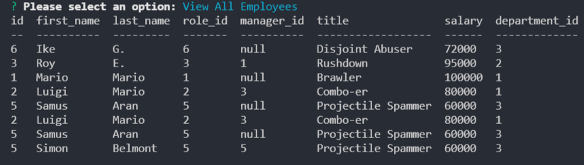

# Back-End Employee Management System

## Description
This is a back-end program for creating and managing departments and teams.



## Installation
This application is hosted via GitHub, and run on the back end using Node.js. From the terminal, use the following script to initialize the program:
```
npm i
```

Before running the application, you'll need to create your database. Using MySQL, run the following code on the db directory:
```
source schema.sql;
```
If you wish, you may also use seeds.sql to populate the database with starter data. To initialize the database, you can run schema.sql again.

[Demonstration video.](https://user-images.githubusercontent.com/56139228/151495372-c9b99026-0581-4d97-8b80-f7421e934d19.mp4)

## Usage
Once installed, you can run *node index.js* to initialize the application. The user will be prompted to view, add, or update data from a main menu. These options will run various MySQL functions to manipulate and return data.

The queries will join tables together to give more robust information. The queries.sql file gives several examples of the way the data is rendered.

## Tools Used
* JavaScript
* MySQL
* Inquirer
* Express.js
* Node.js
* NPM
* GitHub
* GitBash
* Coded in VS Code

## Future Functionality
* There seems to be a strange error in the application's rendering of the employee table, where the employee ID becomes the role ID when the tables are joined together. This isn't reproduced when querying the same data in MySQL, but finding the cause and fixing it would be good.
* Team members' managers could be updated alongside departments.
* A delete function could be added.
